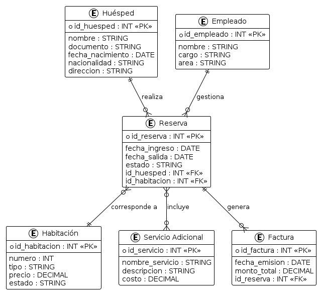

# Sistema de Gestión para Hotel

## Descripción

Un hotel ubicado en una región turística necesita implementar un sistema para la gestión que permita administrar las reservas de habitaciones y los servicios adicionales que ofrece a sus huéspedes. Actualmente, las reservas se gestionan a través de llamadas telefónicas y formularios en papel.

Cuando se realiza el check-in de ingreso de un huésped al hotel, se solicita lo siguiente:

- Nombre completo
- Documento de identidad
- Fecha de nacimiento
- Nacionalidad
- Dirección de residencia
- Número de teléfono
- Correo electrónico
- Número de reserva
- Fecha de llegada y salida del hotel
- Forma de pago (tarjeta de crédito, débito o efectivo)
- Asignación de habitaciones
- Facturación de servicios adicionales (spa, restaurant, bebestibles)

El nuevo sistema deberá:

- Controlar todas las funciones mencionadas anteriormente
- Permitir el acceso de los huéspedes a la información de su estancia y cargos a su habitación
- Permitir al personal administrativo modificar, eliminar, hacer check-in y check-out de los huéspedes usando los datos desde la recepción
- Ser accesible desde plataforma web y móvil
- Permitir a los huéspedes hacer reservas en línea, verificar disponibilidad de habitaciones en tiempo real, elegir tipos de habitaciones, contratar servicios adicionales y pagar su estancia de forma segura
- Contar con un módulo de gestión de habitaciones que incluya número de habitación, tipo, capacidad, tamaño, número de camas, y precio por noche
- Permitir facturación del servicio de estadía con cargo a la habitación, incluyendo datos del emisor de la factura (hotel) y del huésped (nombre, RUT, dirección, giro en caso de empresa)

## Modelo Entidad Relacion

## Menu
[MenuOpciones](menu.png)